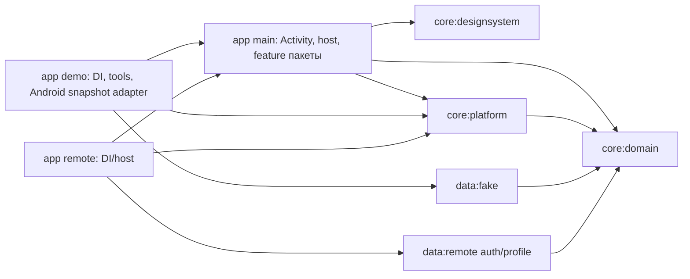
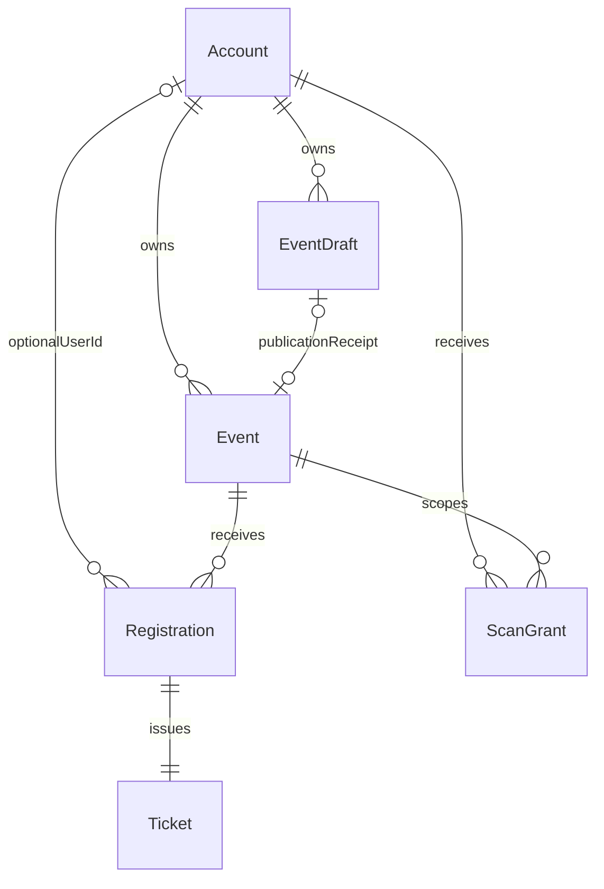

# Фактическая архитектура EventPass Android

**Срез передачи 15 ноября:** M00/M01 TECH_ACCEPTED, M02 WIP_HANDOFF и ещё без итогового ревью. В коде уже меняются модель Event/Question, публичный EventSlug и RemoteEventRepository; это частичная реализация. При чтении учитывать [актуальный handoff M02](validation/t10-m02-handoff-2026-11-15.md), решения 08/34 и исходники; следующий исполнитель должен синхронизировать затронутые разделы перед REVIEW_PENDING. Наличие описания здесь не подтверждает завершение WIP.

M01 auth/session уже реализован: [фактические ports, ownership, transport и cleanup](architecture/t10-session-transport.md). Остальные ещё не мигрированные product-разделы описывают demo, не remote.

Целевая адаптация к принятым серверным правилам описана в [34: ADR-T10-01–07 и M00–M09](34-api-migration-plan.md). M01 auth/profile уже реализован, M02–M09 ещё не выполнены. Ниже product-поведение demo вне auth; его старые verify/form/lifecycle ограничения не являются новыми требованиями к remote. Обновлять соответствующие разделы вместе с кодом каждого M.

Текущий срез — T01–T09 demo: общий store/schema 5, профиль без изменения identity, свои PDF/current Active, owner XLSX и demo outbox resend. T07 camera/UI и H3/H4 ждут человека, Q10/deletion и T10 remote отсутствуют. [T09 ownership/операции](architecture/t09-profile-files.md), [attendance](architecture/t08-attendance.md), статусы — [06](06-delivery-plan.md).

## Модули и зависимости исходников

```mermaid
flowchart LR
    appMain["app main: Activity, host, feature пакеты"] --> domain["core:domain"]
    appMain --> design["core:designsystem"]
    appMain --> platform["core:platform"]
    platform --> domain
    demo["app demo: DI, tools, Android snapshot adapter"] --> appMain
    demo --> fake["data:fake"]
    fake --> domain
    demo --> platform
    remoteApp["app remote: DI/host"] --> appMain
    remoteApp --> remote["data:remote auth/profile"]
    remote --> domain
    remoteApp --> platform
```

`app main`/`app demo` — source sets **одного** Gradle-модуля, не два модуля. Прямая зависимость `app → data:fake` объявлена только demoImplementation. Точные declarations — [app](../app/build.gradle.kts), [platform](../core/platform/build.gradle.kts), [fake](../data/fake/build.gradle.kts), [domain](../core/domain/build.gradle.kts), [designsystem](../core/designsystem/build.gradle.kts).

- MVVM: Route → ViewModel → repository/domain → UiState → Screen. Use case только при сложной/повторной координации; BaseViewModel отсутствует и не требуется.
- Hilt выбирает реализации в [DemoModule](../app/src/demo/kotlin/ru/eventpass/app/di/DemoModule.kt). UI не знает concrete fake/DTO/storage.
- Domain и fake — Kotlin/JVM; platform/designsystem/app — Android. Domain не зависит от Android/Hilt/Compose.
- M01: demoDebug и remoteDebug, release отключён. Remote auth/profile работает через data:remote; остальные product ports — FeatureUnavailable. Fake/tools/gallery отсутствуют в remote runtime/APK. [Точные владельцы и acceptance](architecture/t10-session-transport.md).
- Фичи auth/event/tickets/myevents/editor/checkin/volunteers/dashboard/profile/documents и demo/gallery — пакеты app. Profile и документные действия подключены; deletion/Q10 отложен. Core platform даёт links/QR/cover/PDF/XLSX/ContentResolver streams и CameraX preview/analyzer, без repository/решения о проходе.

Контракты/state/persistence T07 — [независимая основа T07](architecture/t07-checkin-foundation.md). Реестр значимых классов, их ограничения и точки изменения — [responsibilities](architecture/responsibilities.md).

## Предметные связи реализованного среза

```mermaid
erDiagram
    Account ||--o{ Event : owns
    Account ||--o{ EventDraft : owns
    Account o|--o{ Registration : optionalUserId
    Event ||--o{ Registration : receives
    Registration ||--|| Ticket : issues
    Account ||--o{ ScanGrant : receives
    Event ||--o{ ScanGrant : scopes
    EventDraft o|--o| Event : publicationReceipt
```

Это связи локальной domain-модели, не структура backend tables. Account — id/email/emailVerified; имя/proof/challenges fake хранит отдельно в AuthData. У guest Registration userId может отсутствовать. Собственные tickets выдаются repository по email подтверждённой текущей сессии, не клиентской привязкой произвольного email. Повторные регистрации после cancel возможны, но действующий билет один.

Вопросы встроены в Event, `formVersion` — scalar версия схемы, а Registration содержит typed answers и версию. Отдельной persisted FormVersion нет; первые CheckInRecord входят в общий snapshot. ScanGrant содержит eventId/userId/active и меняется owner-only VolunteerRepository. CheckInRepository переводит Active → Used и сохраняет первый CheckInRecord; ScannerViewModel связывает прежний ScannerController с Route и platform камерой.

| Модель | Ответственность / инвариант |
|---|---|
| Event | Валидная опубликованная модель; title/time/zone/venue, capacity, lifecycle/registrationOpen, questions/formVersion, metadata/cover/revision |
| EventFields / EventDraft | Неполные редактируемые данные; owner/revision и publication receipt отдельно от валидного Event |
| Registration | Email/optional userId, contact/answers/consent/time/formVersion; история сохраняет факт первого участника |
| Ticket / GuestTicketSnapshot | Server билет/status и компактный snapshot выдачи; guest UI lifetime отдельно от server persistence |
| ScanGrant | Независимая связь на E, не глобальная роль; owner grant/revoke в общем store |
| CheckInRecord / QrToken / ManualCode | Первый проход и отдельные typed credentials; legacy Used без record не получает выдуманную историю |
| EventCover | Opaque managed asset descriptor, не path/Bitmap/bytes |
| Profile / DocumentSnapshot | Изменяемые поля отдельно от Account; Авторизованный immutable export snapshot, transient session generation |
| Session / SessionSnapshot | Auth + generation; remote bearer persist только за TokenStore, не в Session/route; fake session transient |

Источники: [EventModels](../core/domain/src/main/kotlin/ru/eventpass/core/domain/event/EventModels.kt), [EventEditing](../core/domain/src/main/kotlin/ru/eventpass/core/domain/event/EventEditing.kt), [registration](../core/domain/src/main/kotlin/ru/eventpass/core/domain/registration/RegistrationModels.kt), [auth](../core/domain/src/main/kotlin/ru/eventpass/core/domain/auth/AuthRepository.kt).

## Права и бизнес-границы

- Один аккаунт, независимые ownership/grant/ticket. Capabilities вычисляются EventAccessPolicy для eventId; не выбирать одну «самую сильную роль».
- Public EventDetails доступен по ссылке после публикации. Draft/editor защищены owner guard в read и mutation; UI-кнопка не является защитой.
- canScan исполняется CheckInRepository и scanner UI; owner AttendanceRepository читает список/summary и отменяет registration; owner export выполняет DocumentsRepository, перед передачей файла повторяет доступ.
- После startsAt нельзя регистрироваться, но Event не становится Finished автоматически без endsAt. Закрытие регистрации не аннулирует выданные билеты/публичное описание.
- capacity — общий лимит, remaining — производное; null policy capacity означает Unlimited, ошибка чтения не Unlimited. Места распределит сервер; Android не моделирует его гонку.
- Вопросы фиксируются после первого успешного guest/auth submit даже после cancel всех. Revision защищает lost update, formVersion — схему ответов.

Продукт — [01](01-product.md)/[12](12-backend-answers-2026-10-27.md), доступ/проверки — [invariants](architecture/invariants.md). Сроки жизни не следуют из ER-связей: см. [state ownership](architecture/state-ownership.md).

## Что существует, что остаётся планом

| Область | Текущая реализация | Будущее |
|---|---|---|
| Данные | Один FakeProductState, StateFlow/Mutex, полный schema 5 snapshot, AtomicFile adapter | data:remote и реальная server auth/observe интеграция T10 |
| UI | Auth, common E/форма/guest QR/manual, Tickets, MyEvents/editor/cover/publish, Volunteers/Scanner/Dashboard, Profile и SAF documents | Q10/deletion после согласования, H3/H4 |
| Связность | Внутри одного процесса/сохранённых demo-данных | Синхронизация между телефонами требует backend |
| Offline | Управляемый локальный fake; Network/Timeout как отдельные сценарии | Проверенный production cache/remote recovery не реализованы |

Перенос на backend меняет adapters/DI/DTO mapping и session protocol; совместимость ports/UI нужно проверять по реальному контракту, а не обещать замену одной строки URL. Текущие demo passwords/token generation/storage не production solution.

## Поддерживающие карты

- [Ответственность](architecture/responsibilities.md): кто владеет чем и куда вносить изменение.
- [Lifecycle](architecture/state-ownership.md): память, saved state, disk, logout/flow close.
- [Операции](architecture/operations.md): guest submit, login/logout, save/publish и commit.
- [Инварианты](architecture/invariants.md): правила → реализация → test, с границами доказательств.
- [03](03-navigation.md) и [05](05-data-contracts.md): фактические маршруты и контракты хранения.

Прежняя целевая спецификация сохранена [в истории](history/2026-10-30-architecture/README.md); новые изменения вносятся в актуальное описание, а не добавляют над ним ещё одну датированную версию.

## Обновление видимого экрана T09a

Общий EventPassRefresh в core:designsystem рисует gesture/indicator/semantics без domain/navigation/repository. Конкретный Route связывает read своего entry VM и resource, initial/lifecycle/manual single-flight согласованы через visible + RESUMED и поколения. Общий store/schema/модули прежние; ProfileRepository.refreshProfile и VolunteerRepository.refreshVolunteers — минимальные read-порты, без команд/HTTP. [Адресное обновление T09a](architecture/t09a-refresh.md).
